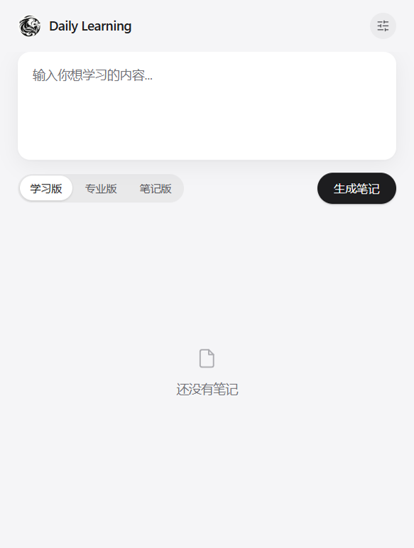
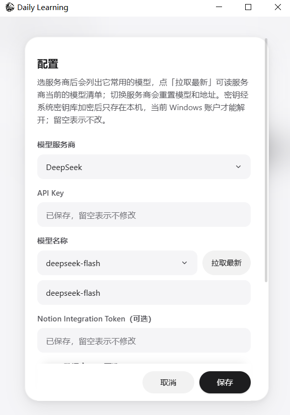
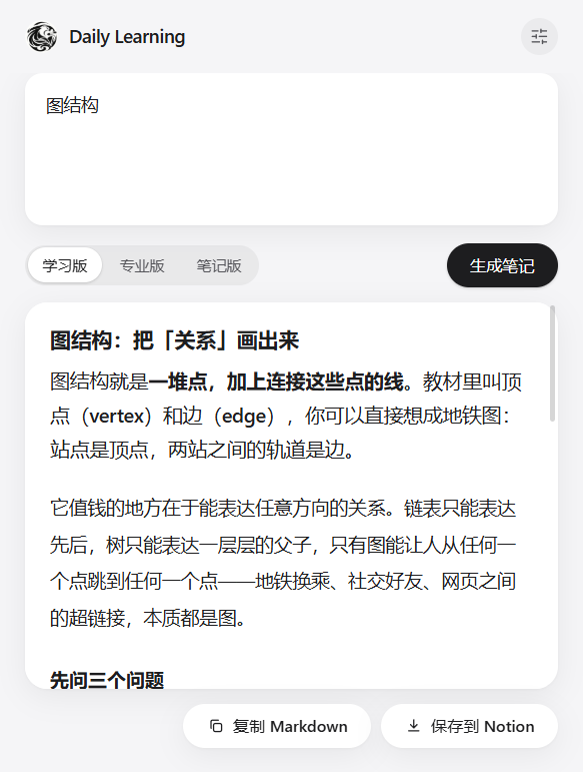

# Daily Learning

Windows 桌面端 AI 学习笔记助手。输入一个概念，一次拿到三种讲解版本，选一份归档进 Notion 或存成本地 Markdown。



## 它解决什么问题

想让 AI 讲一个陌生概念，通常得到的是**一坨不深不浅、格式随心情**的回答，而且它只活在那个聊天窗口里：

- **讲法不合胃口**：想要大白话它给你论文腔，想要机制它给你科普。你只能重新问一遍，再赌一次。
- **问完就散**：五段对话之后，那段真正有用的讲解已经翻不到了，等于没学。
- **工具不对路**：为了这个动作要开着浏览器、登录、建对话、复制、粘贴、排版——多数人在这一步放弃。

Daily Learning 把这件事压成一个桌面动作：**一次提问，同时拿到「学习版 / 专业版 / 笔记版」三种讲法**，点标签切换（三个请求是并发发的，切换零等待），看中的那份一键进 Notion 或落成本地 `.md`。

## 主要功能

| 功能 | 说明 |
|------|------|
| 一次生成三版 | 学习版（大白话 + 生活类比 + 收尾一句「一句话记住」）、专业版（机制、取舍、常见误区）、笔记版（分层标题 + 短句列表 + 对照表格）。三版不只是文案不同，**排版也不同**：笔记版结构化，学习版/专业版是连贯讲解 |
| 切档零等待 | 三个请求并发发出，点版本标签只是切换视图，不再请求接口 |
| 多服务商 | DeepSeek / Kimi / 智谱 / 通义 / OpenAI 预设，或填任意 OpenAI 兼容地址；模型名可从接口拉列表，也能手填 |
| 归档到 Notion（可选） | 把当前这一版转成 Notion 块写进你的数据库：1–3 级标题、有序/无序/嵌套列表、表格（重复表头）、代码块（带语言）、待办、折叠块、引用、分割线、行内加粗/斜体/删除线/行内码都保留；库里没有的属性不写，所以不会报 400 |
| 复制 Markdown | 不配 Notion 也能一键把当前这一版全文带走 |
| 本机留档（默认关） | 打开「生成后自动存到本机」后，每生成一版就往你指定的文件夹写一个 `.md`；路径可自定义，留空用默认目录 |
| 随时中止 | 生成中主按钮变「中止」，掐掉还在飞的请求，已经回来的那一版保留 |
| 部分失败可见 | 哪一档没生成出来，标签上留红点 + 提示，切过去看完整原因，不会静默少一版 |
| 密钥安全 | API Key / Notion Token 用 Windows 系统密钥库（DPAPI）加密后落盘，界面脚本读不到明文 |

## 安装方法

准备三样东西：Windows 10/11（x64）、一个 OpenAI 兼容的 API Key、Node.js（只有从源码跑才需要，`electron-builder` 要求 14 以上）。

> **目前没有可下载的安装包**：[Releases](https://github.com/jklzues/daily-learning/releases) 页面是空的——安全与体验重构之后还没重新出包。所以要么从源码跑，要么照下面自己打一份。

**从源码运行**

```bash
git clone https://github.com/jklzues/daily-learning.git
cd daily-learning
npm install     # 运行时依赖只有 marked（Electron 和 electron-builder 是开发依赖）
npm start       # 启动桌面窗口
```

**打包成 exe**

```bash
npm run build:win   # 产物在 release/：便携版 .exe + NSIS 安装程序
```

## 使用方法

**1. 首次配置。** 第一次启动会自动弹出配置窗：选服务商 → 填 API Key → 选模型（点「拉取最新」从接口取，或手填）。Notion 两项可以留空，不影响生成。



**2. 输入主题并生成。** 回到主界面，在输入框里写一个概念，点「生成笔记」。三个版本同时开始生成，主按钮期间变成「中止」。



**3. 切换版本。** 点上方的版本标签，或让标签获得焦点后用 `←` `→` 切换（`Home` / `End` 到两端）。

**4. 留下你要的那份。**

- 「复制 Markdown」→ 当前这一版的原文进剪贴板
- 「保存到 Notion」→ 在数据库里新建一页，标题是 `主题 · 版本名`
- 打开「生成后自动存到本机」→ 每版直接写成 `.md`，配置窗里可「自定义保存位置」或「打开文件夹」

**5. 随时改配置。** 点标题栏齿轮（或首次启动未配置时自动弹出）。密钥字段留空表示不修改已保存的值。

**快捷键**：`F12` / `Ctrl+Shift+I` 开发者工具 · `Ctrl+Q` 退出 · `Esc` 关闭配置窗。

## 输入输出示例

输入主题：**TCP 三次握手**

同一次提问拿到的三版，结构上的差别是这样的（下面是**示意节选**，实际内容由你选的模型决定）：

**学习版** —— 连贯讲解，收尾一句引用

```markdown
想象你要给一个不太熟的人打电话：先拨过去问「你现在方便说话吗」，对方答「方便」，
你再说「那我开始讲了」。TCP 建立连接就是这三句话……

> 一句话记住：三次握手是为了让双方都确认「我能说、你能听」。
```

**专业版** —— 机制与取舍，段落论述

```markdown
TCP 是面向连接的字节流协议，连接的建立需要双方各自确认自己的发送与接收能力，
因此同步与确认必须交叉出现两次以上……两次握手的问题在于失效的连接请求
可能被服务端误认为是新连接……
```

**笔记版** —— 分层标题 + 短句列表 + 表格

```markdown
## 概念
- TCP：面向连接、可靠、字节流传输协议
- 三次握手：建立连接时的 SYN / SYN-ACK / ACK 交换

## 为什么是三次
| 握手次数 | 结果 |
|---|---|
| 两次 | 失效请求可能造成资源浪费 |
| 三次 | 双方均确认自己的收发能力 |

**结论**：三次是「双方收发正常」的最小次数。
```

**输出落地的三种形态**

| 去处 | 结果 |
|------|------|
| 剪贴板 | 当前这一版的 Markdown 原文 |
| Notion | 新页面，标题 `TCP 三次握手 · 学习版`，库里若有名为 `Date` 的日期属性就填当天本地日期，正文为转换后的块 |
| 本地文件 | `2026-10-02 09-41-07 学习版 TCP 三次握手.md`（时间用本地时区；主题里的 `\ / : * ? " < > \|` 与控制字符换成空格，限长 40） |

## 技术栈

| 层级 | 技术 |
|------|------|
| 桌面框架 | Electron 35（Chromium 134） |
| 界面 | 原生 HTML / CSS / JavaScript，无框架 |
| AI 接口 | OpenAI 兼容 `chat/completions`（多服务商预设 + 自定义） |
| 归档 | Notion API `2022-06-28` |
| Markdown 渲染 | marked v4（渲染前转义 HTML） |
| 本地配置 | JSON 文件 + Windows DPAPI（`safeStorage`）加密密钥字段 |

## 项目结构

```
.
├── main.js                    # 主进程：建窗口、装守卫
├── preload.js                 # contextBridge 白名单，渲染进程唯一的出口
├── index.html                 # 单页界面 + CSP
├── scripts/
│   ├── handlers.js            # ipcMain 通道注册（正式启动与测试共用一份）
│   ├── window-guards.js       # 导航 / 弹窗 / webview 拦截，键盘快捷键
│   ├── config.js              # 配置读写、密钥加解密、旧配置迁移
│   ├── providers.js           # 服务商预设与接口地址拼接
│   ├── http.js                # fetch 封装：超时、中止、错误归因
│   ├── api.js                 # 生成笔记、拉模型列表
│   ├── markdown.js            # Markdown → HTML（转义 + 链接协议白名单）
│   ├── notion.js              # Markdown → Notion 块，分批写入
│   ├── notes-store.js         # 本机 Markdown 落盘（目录可自定义、文件名净化）
│   └── renderer.js            # 界面逻辑
├── styles/global.css          # 设计 Token + 全部样式
├── assets/                    # 图标与演示截图
├── docs/                      # 需求 / 设计 / 技术 / 开发计划
└── devlog/                    # 开发日志
```

## 安全边界

桌面壳的默认配置对渲染进程是放开的，这里把它收紧到「界面只能说话，不能动手」：

- `nodeIntegration: false` + `contextIsolation: true`，渲染进程没有 Node 能力，网络与文件读写全部经 `preload.js` 的白名单通道交给主进程。
- CSP：`script-src 'self'` + `connect-src 'none'`，脚本只能来自本地文件，渲染进程发不出任何 fetch / XHR / WebSocket；模型输出里的远程图片按 `img-src 'self' data: https:` 放行（这是为了正常显示配图，其余资源类型一律 `'none'`）。渲染前先把 HTML 转义，链接只放行 `http(s)` 与 `mailto`，图片只放行 `https:`。
- 窗口内导航、`window.open`、`<webview>` 全部拦下；外部链接交给系统浏览器。
- API Key 与 Notion Token 加密后才落盘，跨进程只传「是否已配置」两个布尔值。

## 已知限制

- 需要你自己的 API Key，应用不代理、不中转任何请求。
- Notion 归档只写两样：页面标题（用你数据库自己的标题属性，叫什么名字都行）和 `Date`（仅当库里存在这个日期属性时填，否则跳过）。不会往不存在的属性上写，所以不会报 400，但也不会替你建属性。
- Markdown 里的图片不会变成 Notion 图片块（Notion 的段落放不下行内图片），会退化成一条可读的链接。
- 密钥加密绑定当前 Windows 账户：换机器、换系统用户或重装系统后旧密钥解不开，界面会明确提示重填，而不是伪装成「还没配置」。这是 DPAPI 的固有行为。
- 一次生成 = 三个并发请求，API 花费约是单版的三倍；这是为了让切档零等待，主动做的取舍。
- 只在 Windows 上验证过；macOS / Linux 未测试。

## 文档

- [docs/requirements.md](docs/requirements.md) — 功能需求
- [docs/design-spec.md](docs/design-spec.md) — 设计规范与 Token
- [docs/tech-stack.md](docs/tech-stack.md) — 技术栈与进程边界
- [docs/dev-plan.md](docs/dev-plan.md) — 开发计划与完成状态
- [devlog/](devlog/) — 开发日志

## License

MIT — 见 [LICENSE](LICENSE)。

## 作者

- **jklzues** · GitHub: [@jklzues](https://github.com/jklzues)
